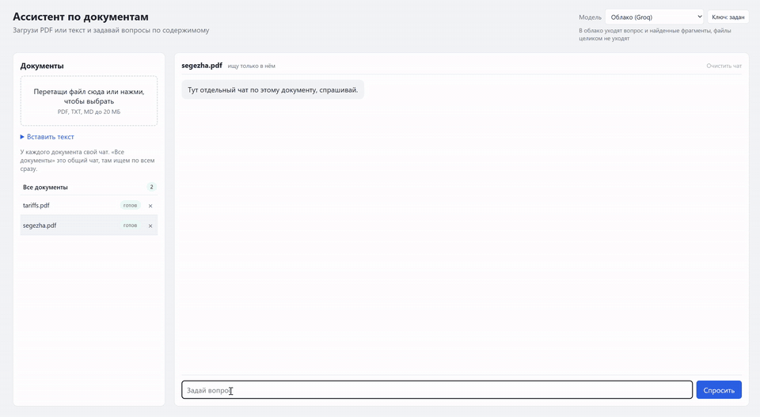
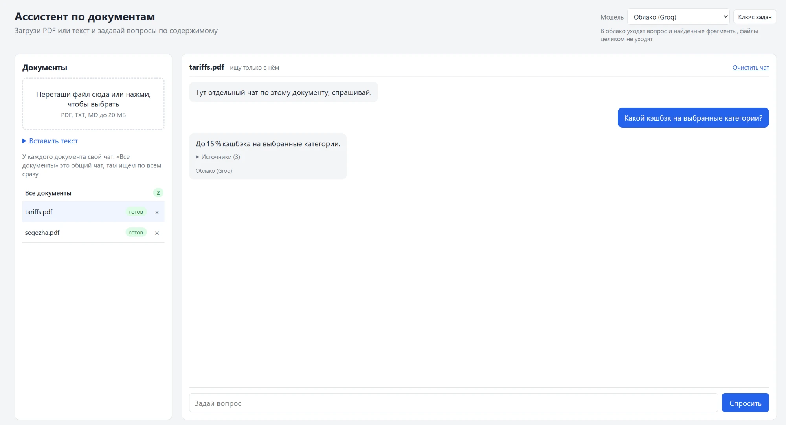
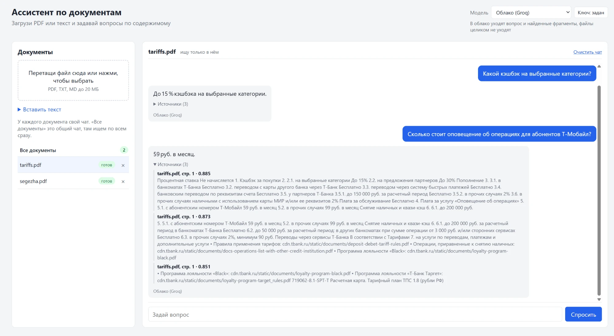
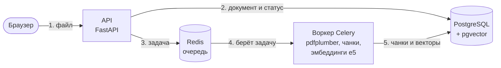
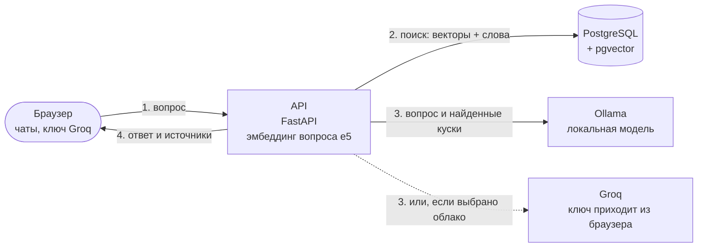
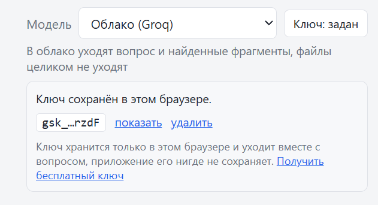

# RalPDFAssistant

RAG-ассистент по документам. Загружаешь PDF или текст, задаёшь вопросы и получаешь ответ вместе с кусками документа, из которых он собран. Я проверял на тарифах банка и на финансовой отчётности. Проект учебный: хотелось на живом примере разобраться с эмбеддингами, pgvector и фоновыми задачами и посмотреть, где такая схема ошибается.



То же видео в хорошем качестве (27 секунд): [docs/demo.mp4](docs/demo.mp4). На записи отвечает Groq, поиск по документу локальный.



Под ответом написано, какая модель отвечала, а блок «Источники» раскрывается и показывает найденные куски со страницей и оценкой сходства:



## Как это устроено

Файл сохраняется, дальше его обрабатывает воркер Celery: достаёт текст, режет на куски примерно по 800 символов, считает эмбеддинги и кладёт всё в PostgreSQL с pgvector. Пока это идёт, у документа статус «в очереди» или «обработка».

На вопрос API ищет куски двумя способами: по смыслу (векторы) и по словам (полнотекстовый поиск Postgres с русской морфологией). Два списка склеиваются, шесть лучших кусков уходят модели вместе с вопросом, и она отвечает только по ним. Эмбеддинги считаются локально. Если выбрана облачная модель, наружу уходят только вопрос и найденные куски, файл целиком никуда не отправляется.

Загрузка документа:



Вопрос по документам:



Стек: FastAPI, SQLAlchemy, Alembic, PostgreSQL + pgvector, Celery + Redis, fastembed, Docker. Отвечает Ollama (локально) или Groq (облако).

## Запуск

Нужен Docker. Чтобы получать ответы, нужно что-то одно из двух (моих ключей в проекте нет):

- Ollama и модель: `ollama pull qwen2.5:7b`, около 4,7 ГБ. Всё остаётся на компьютере.
- Свой ключ Groq. Он бесплатный, берётся на [console.groq.com/keys](https://console.groq.com/keys) и вставляется прямо в интерфейсе.

```bash
docker compose up --build
```

Интерфейс откроется на http://localhost:8000, документация API на http://localhost:8000/docs. Файл `.env` не обязателен, он нужен только чтобы поменять настройки (`cp .env.example .env`).

При первом запуске скачивается модель эмбеддингов, около 2,2 ГБ. Это один раз, дальше она лежит в volume. Поэтому на чистой установке первый документ может обрабатываться несколько минут.

### Ollama на Linux

Контейнер обращается к Ollama на хосте через `host.docker.internal`. На Windows и macOS (Docker Desktop) это работает сразу. На Linux Ollama слушает только `127.0.0.1`, и контейнер до неё не доберётся. Нужно `OLLAMA_HOST=0.0.0.0` (для systemd: `sudo systemctl edit ollama` и в секцию `[Service]` строка `Environment="OLLAMA_HOST=0.0.0.0"`). Если Ollama стоит на другой машине, адрес задаётся в `.env`: `OLLAMA_BASE_URL=http://адрес:11434/v1`. На Linux я это не проверял, только на Windows с Docker Desktop.

## Структура

Слои такие: `routes` принимают запрос, `core` держит логику, `repositories` единственное место, где пишутся запросы к базе.

```
ralpdfassistant/
  routes/         http: документы, вопросы, список моделей
  core/           логика: приём файлов, чанки, поиск и ответ, переиндексация
  repositories/   запросы к postgres и pgvector
  clients/        то что ходит наружу: эмбеддинги, llm
  background/     задача celery
  tables.py       таблицы
  deps.py         то что подменяется в тестах (очередь, модели)
  web/            интерфейс
migrations/       alembic
tests/            pytest, база в testcontainers
eval/             скрипты замеров
```

## Что я пробовал

Замеры делал на двух документах: отчётность за полугодие (21 страница, 18 вопросов, для каждого известно, на какой странице ответ) и одностраничная таблица тарифов (10 вопросов). Выборка маленькая, так что цифры показывают скорее направление, чем что-то доказывают.

Таблицы ниже считались на fastembed 0.4.1. Потом я обновил зависимости из-за уязвимостей, и в fastembed 0.8.1 векторы для того же текста немного другие (косинус со старыми около 0,94). После этого документы нужно переиндексировать. Контрольный прогон на новой версии дал те же порядки: гибридный поиск без контекста 5/9/13 из 18 (MRR 0.450), ответы по тарифам 10 из 10.

### Модель эмбеддингов

Смотрел, в скольких случаях нужная страница попала в топ-5.

| Модель | Топ-5 | Индексация | Размер |
|--------|-------|------------|--------|
| MiniLM | 10 из 18 | 1.7 с | 0.22 ГБ |
| mpnet | 9 из 18 | 9.7 с | 1 ГБ |
| e5-large | 14 из 18 | 35.5 с | 2.24 ГБ |

Взял e5-large, она заметно точнее, хотя индексация в 20 раз медленнее. Для слабых машин в `.env` можно поставить `sentence-transformers/paraphrase-multilingual-MiniLM-L12-v2` (`EMBED_MODEL`). При смене модели таблица чанков пересоздаётся на старте, а документы переиндексируются сами.

### Гибридный поиск

Векторы плохо ловят конкретные слова вроде «выручка» или «руководитель», а поиск по словам не понимает смысл. Поэтому я использую оба и склеиваю списки по методу reciprocal rank fusion. Отключается через `HYBRID=false`.

| | Топ-1 | Топ-3 | Топ-6 | MRR |
|---|---|---|---|---|
| только векторы | 4 из 18 | 9 | 14 | 0.411 |
| гибрид | 7 из 18 | 10 | 14 | 0.518 |

Первые места стали точнее, а в топ-6 попадает столько же вопросов. Некоторые стали хуже: «сколько процентов уплачено» с 4-го места уехал на 9-е.

### Чтение PDF

Сначала брал pypdf, потом перешёл на pdfplumber. Проверял на тарифах, ответ считал верным, если в нём есть нужное значение.

| Библиотека | Верных ответов |
|------------|----------------|
| pypdf | 9 из 10 |
| pdfplumber | 10 из 10 |

pypdf отдавал таблицу колонками: сначала все названия строк, потом все значения. Из-за этого на вопрос про комиссию за снятие наличных «в прочих случаях» модель отвечала «Бесплатно» вместо «2%, минимум 90 руб.». pdfplumber держит строку целиком.

На отчётности с pdfplumber получилось чуть хуже (в топ-6 попали 11 вопросов из 18, было 14). Оставил его, потому что тарифы мне важнее. Ещё пробовал резать чанки по строкам, а не по предложениям, чтобы таблицы не рвались: на отчётности стало хуже (10 из 18), на тарифах разницы нет, убрал.

### Контекст перед куском

Думал, что куску из середины таблицы, где одни цифры, поможет дописанное в начале название документа и страницы (`title`) или ещё и начало страницы (`head`). В базе кусок лежит чистый, контекст влияет только на вектор. Включается через `CHUNK_CONTEXT`.

| Режим | Векторы: топ-1/3/6, MRR | Гибрид: топ-1/3/6, MRR | Тарифы |
|-------|-------------------------|------------------------|--------|
| off | 5/8/12, 0.416 | 6/7/12, 0.449 | 10 из 10 |
| title | 2/7/9, 0.289 | 5/9/12, 0.437 | 10 из 10 |
| head | 1/5/8, 0.229 | 5/8/11, 0.407 | 10 из 10 |

Не помогло, на одних векторах стало даже хуже. Почему, я не проверял. Возможно, добавленный текст одинаковый у всех кусков документа и из-за него их векторы становятся похожи друг на друга. По умолчанию контекст выключен (`off`).

### Локальная и облачная модель

Те же 10 вопросов по тарифам.

| Модель | Верных | Время на 10 вопросов |
|--------|--------|----------------------|
| Groq, gpt-oss-120b | 10 из 10 | не мерил, были паузы под лимит |
| Ollama, qwen2.5:7b | 9 из 10 | 77 секунд |

Локальная на вопрос про снятие наличных ответила только «2%» и потеряла «минимум 90 руб.». Ollama шла на процессоре (Ryzen 7, 32 ГБ), около 8 секунд на ответ.

### Как повторить

Скрипты лежат в `eval/`. Документы нужно сначала загрузить и дождаться статуса «готов». Для облачной модели скриптам нужна переменная `GROQ_API_KEY` (само приложение её не читает).

```bash
docker compose cp eval/. api:/code/eval/

# эмбеддинги: сравнение моделей на своём pdf
docker compose cp твой_файл.pdf api:/code/eval/report.pdf
docker compose exec api python -m eval.retrieval --pdf eval/report.pdf --models intfloat/multilingual-e5-large

# векторы против гибрида (id документа смотри в списке)
docker compose exec api python -m eval.search_modes --doc-id 1

# ответы по тарифам
docker compose exec api python -m eval.answers

# режимы контекста, сам создаёт временные документы и удаляет их
docker compose cp тарифы.pdf api:/code/eval/tariffs.pdf
docker compose exec -e GROQ_API_KEY=твой_ключ api python -m eval.context_modes --report eval/report.pdf --tariffs eval/tariffs.pdf
```

Вопросы и номера страниц лежат в `eval/questions.json` и `eval/answers_tariffs.json`, под другие документы их нужно переписать.

## Чаты

У каждого документа свой чат, плюс общий «Все документы». В чате документа поиск идёт только по нему, в общем по всем сразу. Переключаются кликом по строке слева, а «Очистить чат» в шапке чистит только текущий.

История хранится в браузере (localStorage), по 60 последних сообщений на чат, и после перезагрузки остаётся. Чат удалённого документа удаляется вместе с ним. Вопросы между собой не связаны: модель не видит прошлых реплик, поэтому «а за прошлый год?» не сработает, вопрос надо задавать целиком.

## Модель и ключ Groq

Переключатель модели в шапке страницы. По умолчанию выбрана локальная: у неё ничего не уходит в интернет.



| Модель | Что нужно | Куда уходят данные |
|--------|-----------|--------------------|
| Локально (Ollama) | Ollama и скачанная модель | никуда |
| Облако (Groq) | свой ключ в интерфейсе | вопрос и найденные куски, файл целиком не уходит |

Ключа автора нигде нет: ни в `.env`, ни в коде, ни в образе. При выборе Groq рядом со списком появляется кнопка «Ключ». В панели можно вставить ключ, посмотреть его (он замаскирован, есть «показать») и удалить. Если облако выбрали, а ключа нет, панель открывается сама.

Что происходит с ключом:

- хранится только в браузере (localStorage), на сервер уходит в заголовке `X-LLM-Key` с каждым вопросом;
- приложение его нигде не сохраняет и не пишет в логи;
- отправляется только на адрес Groq, подставить чужой нельзя;
- ключ с пробелами внутри или длиннее 200 символов отбрасывается.

Из-за этого приложение можно выложить для других: у каждого будут свои ключ и лимиты. Минус в том, что пока ключ лежит в localStorage, его мог бы прочитать чужой скрипт на странице. От этого стоит строгий CSP (выполняется только свой `app.js`), но по-настоящему надёжно это решается только входом по аккаунту, его тут нет.

Модели меняются в `.env`: `OLLAMA_MODEL`, `GROQ_MODEL`, `OLLAMA_BASE_URL`. После правки перезапусти контейнеры (`docker compose up -d`).

## API

| Метод | Путь | Что делает |
|-------|------|------------|
| POST | `/api/documents` | загрузить файл (pdf, txt, md) |
| POST | `/api/documents/text` | добавить текст, JSON `{title, text}` |
| GET | `/api/documents` | список документов и статусы |
| DELETE | `/api/documents/{id}` | удалить документ |
| POST | `/api/ask` | вопрос `{question, document_ids, model}`, ответ и источники. Для облачной модели ключ в заголовке `X-LLM-Key` |
| GET | `/api/models` | доступные модели |

## Разработка

```bash
pip install -r requirements-dev.txt
ruff check .
mypy
pytest --cov
```

Для тестов нужен Docker: postgres с pgvector поднимается сам через testcontainers. Вместо настоящей модели эмбеддингов в тестах заглушка, поэтому 2 ГБ скачивать не надо. Если база уже есть (как в CI), её можно указать в `TEST_DATABASE_URL`, тогда контейнер не создаётся. CI (`.github/workflows`) гоняет ruff, mypy, тесты с порогом покрытия 85% и собирает образ.

Если база осталась от версии до alembic, сбрось её: `docker compose down -v`.

## Безопасность

Приложение рассчитано на запуск у себя: порт открыт только на `127.0.0.1`, а входа по паролю и ограничения частоты запросов нет, поэтому в таком виде выставлять его в интернет нельзя. Что сделано:

- чужой сайт, открытый в твоём браузере, не может слать на приложение запросы на изменение (проверка `Origin`) и обращаться к нему под чужим именем хоста (проверка `Host`, список в `ALLOWED_HOSTS`, по умолчанию `localhost` и `127.0.0.1`);
- строгий CSP, а текст документов и ответов вставляется в страницу только как текст;
- ключ Groq нигде не сохраняется и не логируется (подробнее выше);
- контейнер работает не от root, база и Redis снаружи недоступны;
- зависимости закреплены, `pip-audit` по установленным в образ пакетам замечаний не дал (на день проверки, со временем это устаревает).

Если захочешь выложить на сервер, поставь перед приложением reverse proxy с авторизацией и впиши свой домен в `ALLOWED_HOSTS`.

## Что не работает

- Сканы без текстового слоя не читаются, нужен OCR.
- Поиск находит нужную страницу не всегда: в моём замере 4 вопроса из 18 не попали в шесть лучших, хуже всего с таблицами и короткими вопросами про цифры. Порог сходства не помог: оценки у вопросов с ответом и без него перекрываются.
- Модель путает похожие строки таблицы (например, процентные расходы и уплаченные проценты). Важные цифры лучше сверять с источниками под ответом.
- Таблицы из PDF вытаскиваются как обычный текст, структура может поехать.
